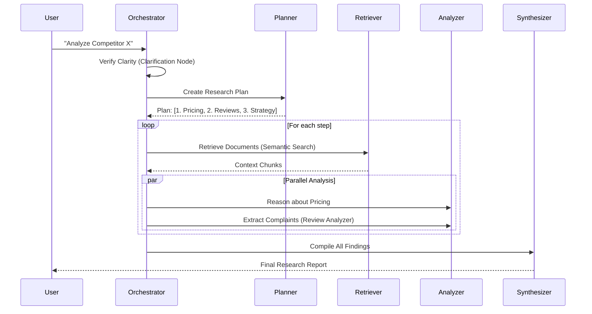

# Researcho: Concept & Implementation Guide

This document provides a comprehensive technical overview of **Researcho**, an agentic research system designed to overcome the limitations of standard LLM chat interfaces.

---

## 1. The Core Concept

### The Problem: Shallow Answers & Hallucinations
Standard Large Language Models (LLMs) like ChatGPT or Gemini are excellent at conversational tasks but struggle with deep, fact-based research:
1.  **Hallucination**: They invent facts when they don't know the answer.
2.  **Lack of Depth**: They often provide surface-level summaries.
3.  **No Critical Thinking**: They accept the first piece of information they find.

### The Solution: Agentic Workflow
Researcho is not just a chatbot; it is an **agentic system**. Instead of generating an answer in one pass, it breaks the problem down:
1.  **Understand**: Determine if the query is clear or needs clarification.
2.  **Plan**: Break a complex question (e.g., "Compare X vs Y") into sub-questions ("What is X?", "What is Y?", "What are the diffs?").
3.  **Retrieve**: Search for real, grounded information from an internal knowledge base (Qdrant).
4.  **Reason**: Analyze the retrieved data, spotting gaps or conflicts.
5.  **Synthesize**: Compile a final, cited report.

This iterative process mimics human research methodology: *Plan → Research → Analyze → Write*.

---

## 2. Architecture & Design

The system is built on a **Graph Architecture** using **LangGraph**. A graph defines valid "states" and "transitions" (nodes and edges), allowing the agent to loop, retry, or branch based on logic.

### High-Level Data Flow

```mermaid
graph TD
    User[User via Frontend] --> API[FastAPI Backend]
    API --> Graph[LangGraph Orchestrator]
    
    subgraph "The Research Brain"
        Graph --> Router{Router}
        Router -- "Simple Query" --> Quick[Quick Search]
        Router -- "Complex Query" --> Deep[Deep Research Loop]
        
        Deep --> Plan[Planner]
        Plan --> Retrieve[Retriever (Qdrant)]
        Retrieve --> Reason[Reasoning & Critique]
        Reason --> Review[Review Analyzer]
        Reason --> Synthesis[Report Generator]
    end
    
    Synthesis --> Output[Final Markdown Report]
```

### Detailed Interaction (Deep Mode)

When a user asks a deep question (e.g., "Analyze competitor pricing strategies"), the system executes the following sequence:



---

## 3. Implementation Details

### Tech Stack Choices
1.  **LangGraph**: Provides the "looping" ability essential for agents. Unlike a linear chain (A->B->C), LangGraph allows A->B->A (retry) or A->B/C->D (parallelism).
2.  **FastAPI**: A high-performance, async Python web framework to serve the agent as an API.
3.  **Qdrant**: A vector database that stores "memory".
    *   **Why?** It allows "Semantic Search". Searching for "slow app" will find documents about "latency issues" because the *meaning* (vector) is similar.
4.  **Google Gemini 2.5 Flash**:
    *   **Why?** It has a massive context window (1M+ tokens) and is extremely fast/cheap, making it perfect for reading hundreds of documents in one go.

### Key Components (The "Nodes")

The backend logic is split into discrete **Nodes** in `backend/graph/nodes/`:

1.  **`planner.py`**:
    *   *Role*: The "Project Manager".
    *   *Logic*: Takes the user query and outputs a list of 3-5 sub-steps.
    
2.  **`retriever.py`**:
    *   *Role*: The "Librarian".
    *   *Logic*: Converts the plan into search queries, queries Qdrant, and returns the most relevant text chunks.

3.  **`review_analyzer.py` (E-Commerce Special)**:
    *   *Role*: The "Data Analyst".
    *   *Logic*: Specifically looks for customer review data. It extracts structured insights: "Top 3 complaints: Battery (Severe), UI (Minor)".

4.  **`synthesis.py`**:
    *   *Role*: The "Writer".
    *   *Logic*: Takes all raw notes, analysis, and retrieved chunks to write the final Markdown report. It ensures every claim has a citation.

### Shared State (`ResearchState`)

Data serves as the "blood" of the system, flowing between nodes via the `ResearchState` dictionary (in `backend/graph/state.py`).

```python
class ResearchState(TypedDict):
    query: str                  # The user's question
    plan: List[str]             # The steps to take
    documents: List[dict]       # Retrieved knowledge
    review_analysis: str        # Structured review data
    report: str                 # Final output
```

Every node receives this state, modifies it (e.g., the Retriever adds `documents`), and passes it to the next node.

---

## 4. How to Extend It

To add a new capability (e.g., "Price Checking"):
1.  **Create a Node**: Write `price_checker.py` that scrapes a URL.
2.  **Update State**: Add `price_data: dict` to `ResearchState`.
3.  **Wire the Graph**: In `orchestrator.py`, add `builder.add_node("price_checker", price_checker_node)` and define when it runs (e.g., in parallel with `retriever`).
