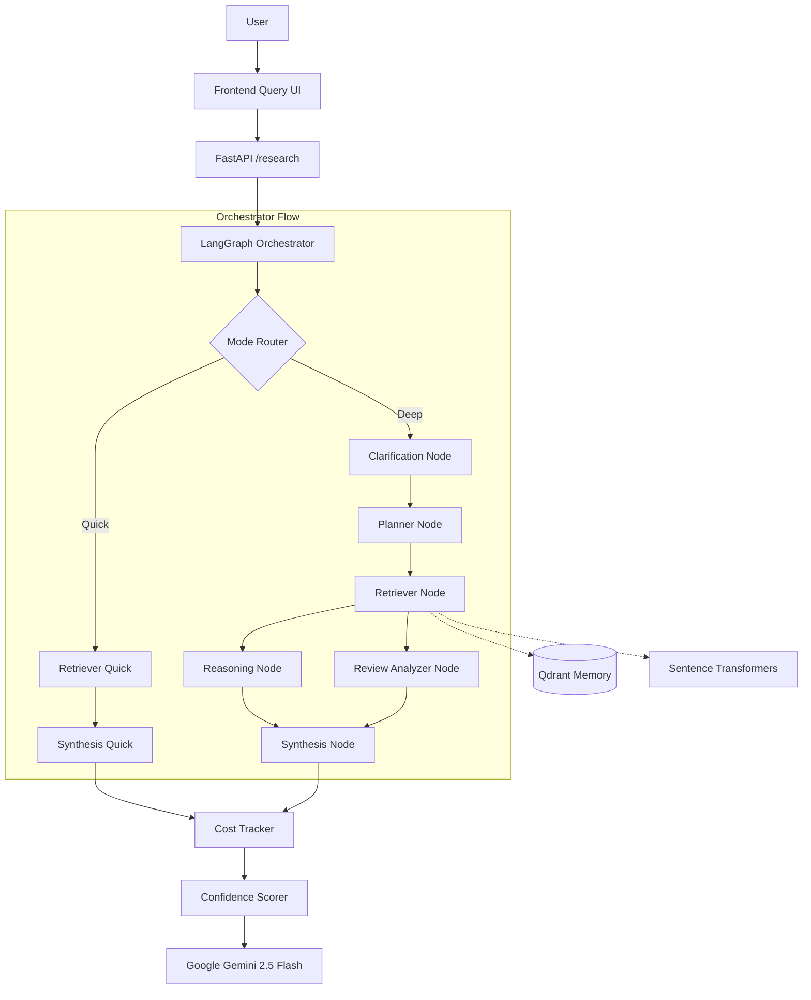
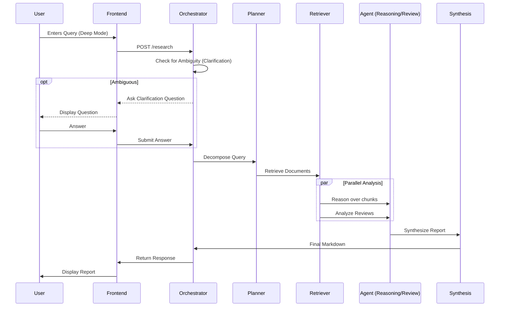

# ⚗️ Researcho: E-Commerce Intelligence Agent

**Production-grade deep technical research agent specialized for E-Commerce — powered by Gemini 2.5 Flash.**

Built with FastAPI · LangGraph · Qdrant · Google Gemini API · sentence-transformers

---

## ✨ Features

| Feature | Description |
|---|---|
| 🛒 **E-Commerce Intelligence** | **Review Analysis:** Extract structured complaints & sentiment.<br>**Gap Analysis:** Identify competitor weaknesses.<br>**Margin Optimization:** Focus research on profitability. |
| ⚡ **Quick Mode** | Focused answer in ~5–15 seconds |
| 🔬 **Deep Mode** | Multi-step plan → retrieve → reason → analyze reviews → structured report |
| 🧠 **Persistent Memory** | Research history & user preferences (Qdrant) |
| 📊 **Confidence Scoring** | Multi-factor score based on sources & similarity |
| 💰 **Cost Tracking** | Token usage tracking (free tier = $0.00) |
| 🤔 **Clarification Loop** | Asks one question when the query is ambiguous |
| 🆓 **Free & Fast** | Gemini 2.5 Flash free tier — 1500 requests/day |

---

## 🚀 Quick Start

### 1. Prerequisites

- **Python 3.10+** — [python.org](https://python.org)
- **Free Gemini API key** — [aistudio.google.com/app/apikey](https://aistudio.google.com/app/apikey) (sign in with Google → Create API key)
- No GPU needed. No large model downloads.

### 2. Configure

Copy the example env file and add your key:

```bash
cp .env.example backend/.env
```

Edit `backend/.env`:

```env
GEMINI_API_KEY=your_api_key_here
```

### 3. Run

```bash
# Windows — one-click (creates venv, installs deps, starts server)
.\start.bat

# Any OS — manual
cd backend
python -m venv venv
source venv/bin/activate   # Windows: venv\Scripts\activate
pip install -r requirements.txt
python main.py
```

### 4. Open the UI

Visit **[http://localhost:8000](http://localhost:8000)**

---

## ⚙️ Configuration

All settings in `backend/.env`:

```env
# ── Gemini LLM ────────────────────────────────────────────────────────────
GEMINI_API_KEY=your_api_key_here
LLM_MODEL=models/gemini-2.5-flash
LLM_MAX_NEW_TOKENS=2048
LLM_TEMPERATURE=0.1

# ── Embeddings (runs locally, no key needed) ──────────────────────────────
EMBED_MODEL=sentence-transformers/all-MiniLM-L6-v2
EMBED_DIM=384

# ── Qdrant ────────────────────────────────────────────────────────────────
QDRANT_MODE=memory   # memory (no setup) or local (persistent)
```

### E-Commerce Preferences (State Control)
These can be controlled via the API or expanded in the frontend:
- **Focus Area:** `margins`, `reviews`, `pricing`, `competitor_gap`
- **Business Role:** `product_manager`, `analyst`, `founder`
- **Primary Metric:** `revenue`, `conversion`, `return_rate`

---

## 🗺 Architecture

The system uses a LangGraph-based workflow with parallel execution for efficiency.



### Deep Mode Interaction Flow



---

## 📡 API Reference

| Endpoint | Method | Description |
|---|---|---|
| `/health` | GET | Liveness check |
| `/research` | POST | Run a research query |
| `/preferences/{user_id}` | GET/PUT | User preferences |
| `/documents/index` | POST | Index a document chunk |
| `/docs` | GET | Interactive Swagger UI |

**Example:**
```bash
curl -X POST http://localhost:8000/research \
  -H "Content-Type: application/json" \
  -d '{
    "query": "Analyze customer complaints for Competitor X", 
    "mode": "deep", 
    "user_id": "me",
    "focus_area": "reviews"
  }'
```

---

## 📦 Adding Documents to the Knowledge Base

To analyze specific products or reviews, index them first:

```bash
curl -X POST http://localhost:8000/documents/index \
  -H "Content-Type: application/json" \
  -d '{"text": "Customer Review: The battery life is terrible...", "source": "product_reviews.csv", "metadata": {"type": "reviews"}}'
```

---

## 📂 Project Structure

```
researcho/
├── backend/
│   ├── main.py               # FastAPI app
│   ├── config.py             # Settings
│   ├── graph/
│   │   ├── orchestrator.py   # LangGraph definition
│   │   ├── state.py          # Shared state (incl. E-commerce fields)
│   │   └── nodes/            
│   │       ├── review_analyzer.py  # [NEW] Structured review analysis
│   │       ├── reasoning.py        # Deep reasoning loop
│   │       └── ...
│   ├── memory/               # Qdrant integration
│   ├── llm/                  # Gemini provider
│   └── prompts/              # System prompts
├── frontend/
│   ├── index.html
│   ├── style.css
│   └── app.js
├── start.bat
└── README.md
```

---

## 🔑 License

MIT – use, modify, distribute freely.
